# JApps
2 day trial for server backup:
05YJTM-H216BS-Y1CQF4-QJX98Q-W9Q8ES-MJHVC2-HEJKN8-HEX9AV-KJ5JCS-55ZJXN-50FS10-X5PX1J-1SQF8K-A3ETBW-18SEVF-NEHQ05-GDXCWK-BZV5MH-4HDFD4

Five Android apps that keep your data on your phone, as files you can still read
if the apps disappear. No account, no company server, no telemetry.

The signed APKs are published under Releases. The source is not published here.

<p align="center">
  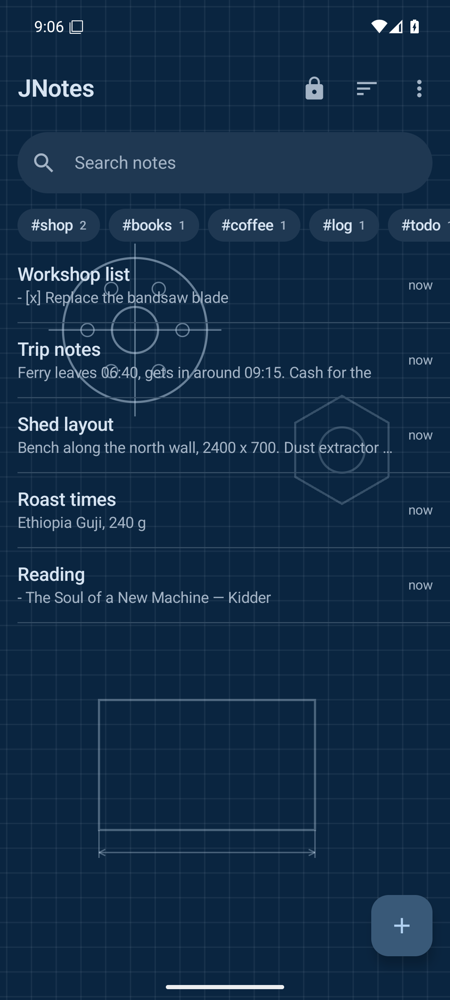
  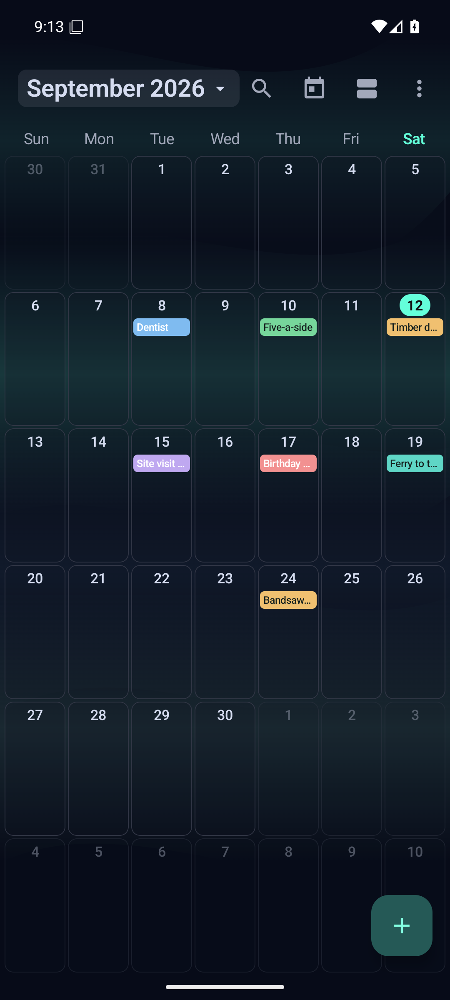
  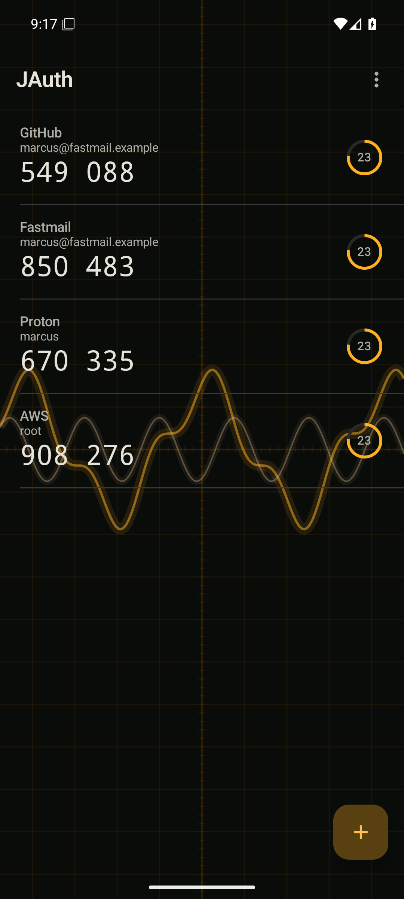
  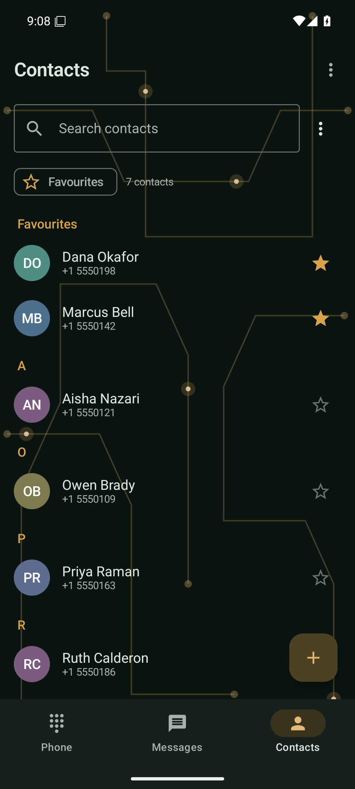
  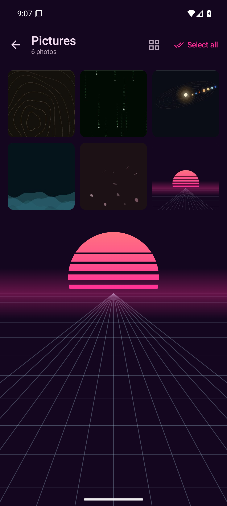
</p>
<p align="center">
  <sub>JNotes &nbsp; &middot; &nbsp; JCalendar &nbsp; &middot; &nbsp; JAuth &nbsp; &middot; &nbsp; JPhone &nbsp; &middot; &nbsp; JPhotos</sub>
</p>

---

## JAuth - two-factor codes

Codes generated on the phone and kept there.

- Seeds are **encrypted with a key that cannot leave the device**, and the phone
  will not use that key until it has seen your fingerprint or PIN.
- **No Google Play Services.** QR scanning is ZXing and CameraX - no Firebase,
  no ML Kit, no Play dependency of any kind.
- **Imports from Google Authenticator, Aegis, 2FAS**, or any `otpauth://` list,
  so trying it does not mean re-enrolling thirty accounts. Google's transfer QR
  is read on-device and its contents listed for you to pick from.
- **Your codes are not trapped.** Export everything to a file whenever you want,
  or save an encrypted backup under a passphrase you choose. You can set up
  another authenticator from that export and delete JAuth.
- Free, and always will be.

## JCalendar - events as `.ics` files

One event, one `.ics` file, in storage only the app can touch. Each file is a
single `VEVENT` inside a `VCALENDAR` - the same way a CalDAV server stores one -
so a file copied off your backup server is byte-identical to the one on the
phone, and nothing is converted on the way out.

## JNotes - Markdown notes

Real `.md` files, openable in any editor on any computer years from now.
**Obsidian-compatible**: `[[Wikilinks]]` and `#tags` use the same syntax, so a
mirrored folder opens there and works. Live preview, tappable checklists that
write back into the file, attachments, full-text search.

Notes you would rather were encrypted go in a **vault**, unlocked by password or
fingerprint with an idle timeout you set. A vault note is encrypted on the device
and is never written to the backup mirror in readable form.

## JPhone - phone, messages and contacts

A replacement for Google Phone, Messages and Contacts. Three tabs.

Registers as **default phone app** (places calls through `TelecomManager`, draws
its own in-call screen - answer, decline, mute, speaker, hold, DTMF - including
over the lock screen) and **default SMS app** (single and multipart SMS with
delivery status, MMS with photos and voice notes).

Contacts are written out as `.vcf` and conversations as readable transcripts.

## JPhotos - gallery and editor

**Reads what is already on the phone.** Your pictures stay in the folders
Android already keeps them in - Camera, Screenshots, Downloads - and JPhotos
does not move or reorganise anything on its own. Uninstalling it leaves every
photo where it was.

**Nothing uploads by itself.** There is no background sync; every transfer is
one you started, on pictures you picked. Editing offers a copy by default -
overwriting the original is a separate, deliberate choice.

Android 14's "selected photos only" grant is supported, so you can hand over a
few pictures rather than the whole library and the app stays usable.

---

## What the five have in common

**The app owns the data, and the folder is a mirror.** What you create lives in
the app. If you switch backup on, a 1:1 copy is kept in a folder you choose - on
the device, or on your own FTP, SFTP or SMB server. The copy is a copy: deleting
the app does not take your backup folder with it, and nothing needs a server to
work.

There is no JApps server to point at, because there isn't one.

**One key unlocks all five.** Server backup is the single paid feature. A key is
bought once, arrives as text, and is checked entirely on the device - nothing is
sent anywhere and no account exists. That is not a convenience: an app that
argues it makes no network calls cannot then phone home to ask permission. Paste
a key into any one of the five and the other four pick it up on their next
launch.

**One theme.** Light, dark or system, across eight shared palettes. Every app
opens on Paper.

<p align="center">
  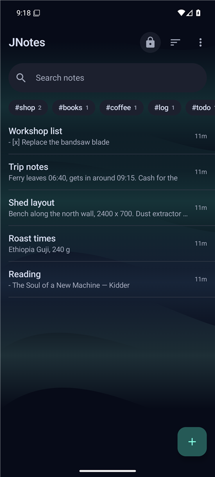
  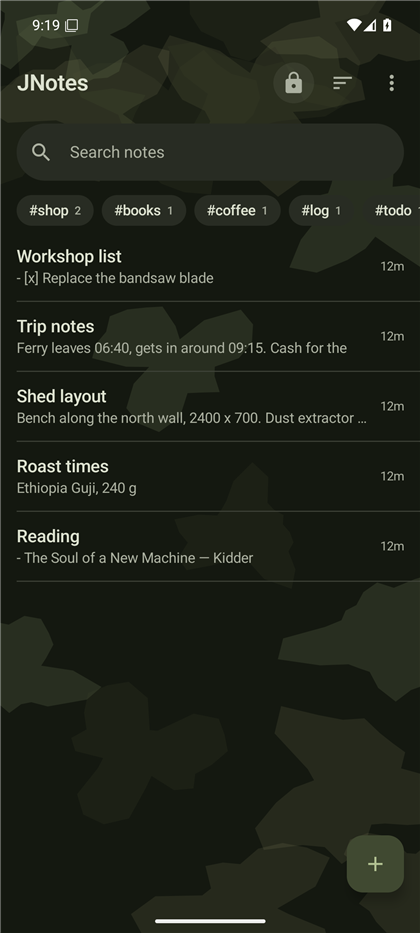
  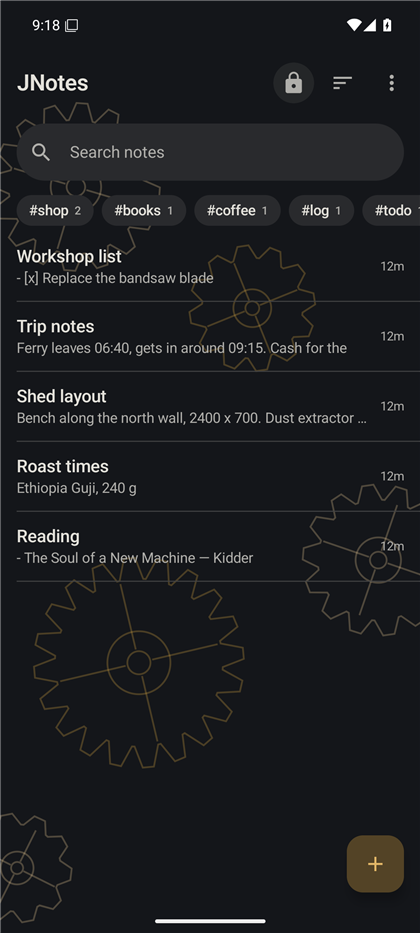
  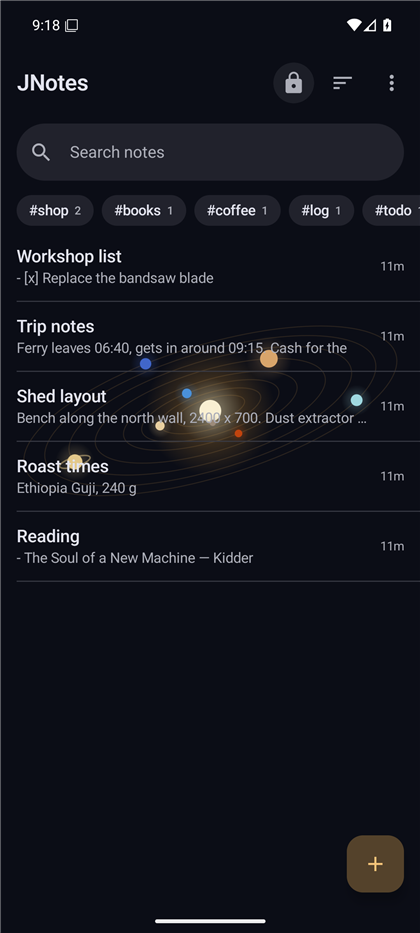
  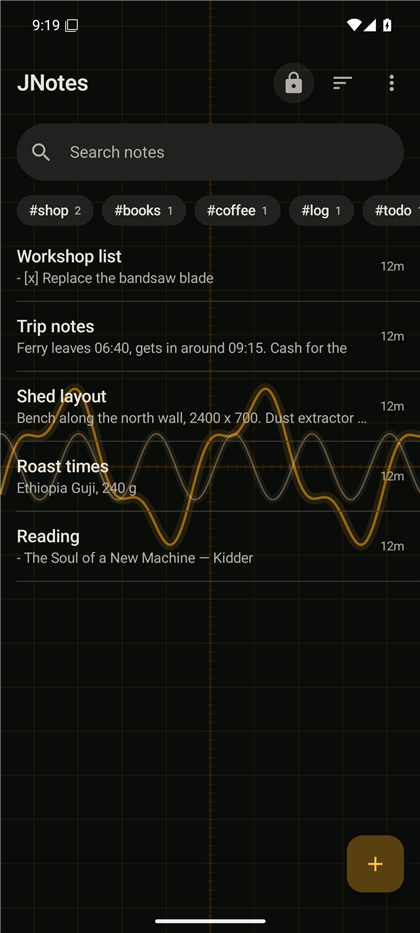
  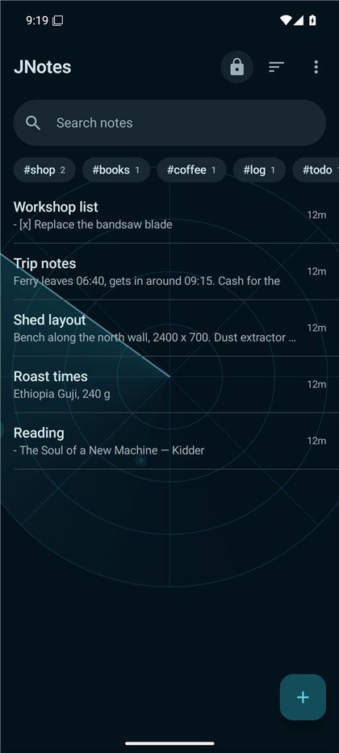
  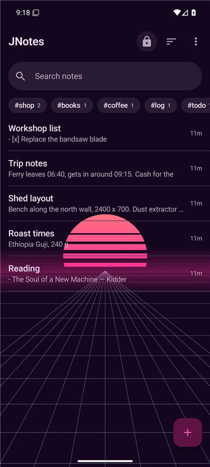
  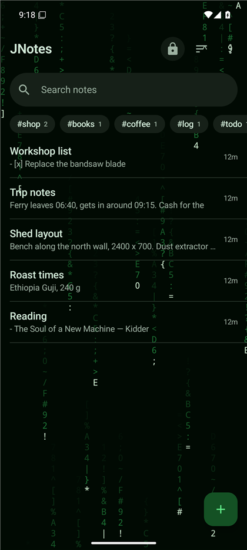
</p>
<p align="center">
  <sub>Aurora &nbsp; &middot; &nbsp; Camo &nbsp; &middot; &nbsp; Gears &nbsp; &middot; &nbsp; Orrery &nbsp; &middot; &nbsp; Scope &nbsp; &middot; &nbsp; Sonar &nbsp; &middot; &nbsp; Synthwave &nbsp; &middot; &nbsp; Terminal</sub>
</p>

---

## Install them

Install as many or as few as you want. They work on their own, and none of them
needs the others to be present.

Android will not install an app from outside a store until you allow it once.
That is a normal part of installing anything this way, not a sign of a problem.

1. On the phone, open [Releases](../../releases) and download the ones you want.
   Each is a single `.apk` file.

2. Tap a downloaded file. Android will say it is not allowed to install unknown
   apps from this source.

3. Tap **Settings** in that message, turn on **Allow from this source**, then press
   back and tap **Install**. The remaining files install without asking again.

4. Open the app. Anything it needs permission for is asked for at the point it is
   needed, with the reason on screen.

You can turn that permission back off afterwards. It applies to the app you
downloaded with, usually your browser, and not to the phone as a whole.

Updating later is the same steps, and installing over the top keeps your data.

### JPhone needs one extra step

JPhone replaces the phone and messaging apps, so Android will not let it place
calls or send texts until you make it the default. It will offer to do that the
first time you open it. If you decline and change your mind later, it is under
Settings, then Apps, then Default apps.

Nothing is taken over quietly. Until you say yes, JPhone sits there doing
nothing, and setting the old apps back is the same screen.

---

## Getting a key

The five apps are free to download and use. Server backup - mirroring your data
to your own FTP, SFTP or SMB server - is the one feature a key unlocks. Everything
else, including local folder backup, works without one.

If you want that feature, support the project and I will send you a key.

**Suggested: $25.** One key, all five apps, paid once - there is no subscription
and no second purchase. Any amount is welcome, and I will send a key either way.

| Chain | Address |
|---|---|
| Solana | `862YZXoRvaoTiP1AkQEEZ5FFGgPFsUhbEoRu4r44RhSe` |
| Ethereum | `0xF890c6A128920D145D47753D0b1159fA4Db2861d` |

Then email **jessymelanson1265@proton.me** with the transaction hash. I check the
chain, reply with a key, and that is the whole process. There is no checkout, no
account and no third party in the middle.

Transfers on both chains are irreversible - check the address character by
character, and send only native SOL or ETH, or standard tokens on those chains.

### How the key is checked

The key is a block of text. You paste it into any one of the five apps and the
other four pick it up on their next launch.

Verification happens **entirely on the device**, against a SHA-256 hash compiled
into the app. Nothing is transmitted, no licence server is contacted, and the app
works the same with no network at all. That is not a convenience - an app that
argues it makes no network calls cannot then phone home to ask permission.

What follows from that, stated plainly rather than discovered later:

- **A key works offline, forever.** It cannot be revoked remotely, because there
  is nothing to revoke it from.
- **It is not tied to a device or an account**, because neither is registered
  anywhere.
- **Keep it somewhere safe.** I can resend one from the email you used, but
  there is no account to recover it from.

Please do not share your key. The verification is offline by design, which means
the only thing keeping this sustainable is people not passing keys around.

---

## Verify what you downloaded

| File | SHA-256 |
|---|---|
| `JAuth-release.apk` | `e37197c7055ed034b3cd3ac2bfb3c051b3ee4d85ec5fc014154ec87f22e282af` |
| `JCalendar-release.apk` | `60dcca4c00ca326ac7241cd2ec07c97dd346c0f394c1cb34a604a9060a9b2185` |
| `JNotes-release.apk` | `f6d4c73c1cc826801f1ba74ae57b9eaf9bb175e161f62ea58668711055478568` |
| `JPhone-release.apk` | `fd8305bc41f4cd12ae7a623e88bfda4a5d2a6c0150258aa672c7f1fc39a08ddd` |
| `JPhotos-release.apk` | `3417347a0c993f50cab6d4e3556c1b0e14e31b23da1a5c07e6bcf3addf32e575` |

```bash
sha256sum JAuth-release.apk                    # Linux, macOS, git bash
certutil -hashfile JAuth-release.apk SHA256    # Windows
```

## Signing

All five are signed with one certificate. That is load-bearing rather than tidy:
each app answers activation queries only from callers whose signing certificate
matches its own, so separate keys would silently stop one key unlocking the
family.

```
CN=JApps, OU=JFamily, O=JApps, C=CA
753bf85dbbf2cd55862e494733ffe69a14eff96d9c0b8e0883fe347464c7a02f
```

```bash
apksigner verify --print-certs JAuth-release.apk
```

That prints `v1 scheme (JAR signing): false`. It is not missing - with
`minSdk 26`, apksigner only verifies the schemes that platform range uses. Add
`--min-sdk-version 21` and v1, v2 and v3 all verify.

## Requirements

Android 8.0 or later (minSdk 26), built against SDK 36.
